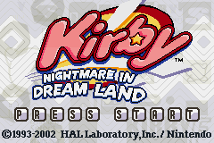

# 안내
이 프로젝트는 포트폴리오 목적으로 제작되었으며, 
모든 에셋의 저작권은 HAL Laboratory와 Nintendo에 있습니다.
상업적 이용을 목적으로 하지 않습니다.

# WinAPI 커비 모작 프로젝트

## 프로젝트 개요
- **프로젝트명**: WinAPI 커비 모작 프로젝트  
- **개발 기간**: 2025년 7월 ~ 8월 (약 6주)  
- **개발 환경**: C++ / Visual Studio / WinAPI  
- **목적**:  
  - 운영체제와 프로그램의 상호작용 이해
  - 객체지향 개념(C++ 심화) 실전 적용  
  - 게임 엔진 내부 구조(루프, 씬, 오브젝트, 생명주기) 이해  
  - 저수준 그래픽 처리 경험 

---

## 주요 구현 기능

### 1. 캐릭터 & 전투 시스템
- 이동, 점프, 공격, 빨아들이기 → 삼키기 → **카피 능력 획득**
- 충돌 처리 및 능력별 전투 로직 구현

### 2. 몬스터
- **웨이들 디, 브론토버트, 웨이들 두, 핫 헤드, 스파키, 위스피 우드(보스)** 구현
- 일부 몬스터는 **카피 능력 보유** → 삼킨 후 커비가 해당 능력 사용 가능
- **상속 기반 구조**로 설계, 이후 **컴포넌트 방식의 확장성** 필요성 학습

### 3. 스테이지 에디터
- 몬스터와 타일을 자유롭게 배치  
- 배치 내용 → 파일로 저장  
- 스테이지 씬에서 불러오기 & 로딩 지원

### 4. 매니저 클래스 (싱글톤 기반)
- 오디오 매니저, 입력 매니저, 리소스 매니저 등  
- 프로젝트 전반에서 **재사용 가능한 관리 구조** 구현

---

## 🛠️ 개발 목표 & 학습 포인트
- **C++ 객체지향 심화**  
  - 추상화, 상속, 다형성, 캡슐화 → 실제 코드에 적용  
  - `virtual` 소멸자, 책임 분리 원칙 학습
- **게임 엔진 구조 이해**  
  - 프레임 루프, 생명주기 함수, 씬/오브젝트 관리
- **디자인 패턴 학습**  
  - **싱글톤 패턴** 실전 적용
- **디버깅 경험**  
  - Visual Studio에서 메모리/변수 추적 및 분석 능력 향상
- **실무 감각 강화**  
  - 프로젝트 구조화 & 코드 관리 역량 확보

---

## 배운 점 & 성과
- **상속 vs 컴포넌트 구조** 차이점을 실제로 체감  
- **책임 분리 원칙**과 **디자인 패턴** 적용 경험  
- **게임 엔진의 내부 구조**를 직접 구현하며 깊이 있는 이해 확보  
- 커비의 핵심 기능을 대부분 구현 → **게임 개발 사이클 전체 경험**  
- AI 코딩 툴 활용 시, 코드 이해를 기반으로 접근해야 효과적임을 체감  

---

## 영상

- 스크린샷:
  - 기본 전투
  - 스테이지 에디터
  - 보스 전투 장면

---

## 향후 개선 아이디어
- 컴포넌트 기반 아키텍처로 리팩토링  
- 다양한 스테이지 및 보스 추가  
- 충돌 처리 & 카피 능력 시스템 고도화  
- 그래픽/사운드 리소스 확장

---
